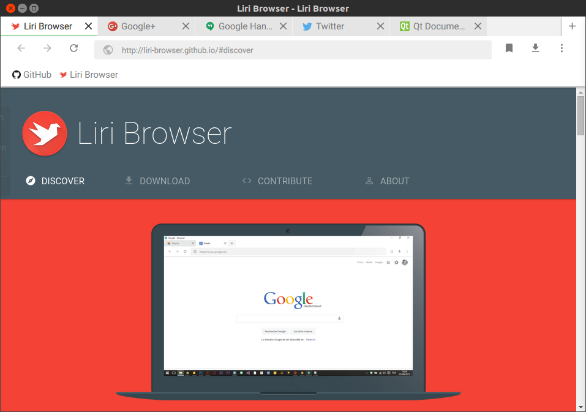
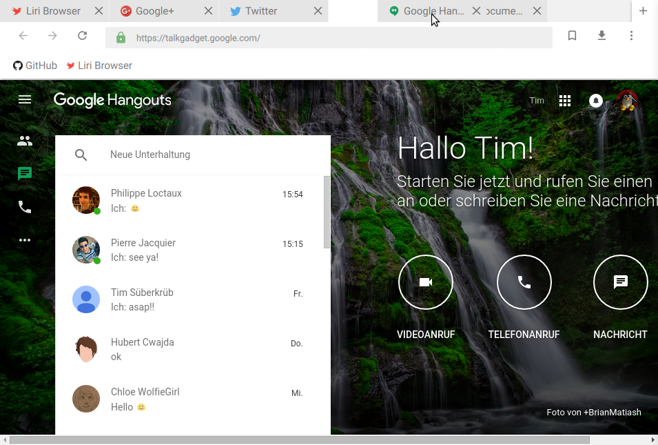

# Liri Browser
A minimalistic material design web browser written for Papyros (https://github.com/papyros/)

See http://papyros.io for more information about Papyros.

## About
Our goal is it to create a minimalistic and simple, yet unique webbrowser that gets out of your way and lets you concentrate on the content. 
Liri's user interface is designed according to Google's Material Design which leads to a clean and beautiful interface.

The name "liri" comes from the Albanian word for freedom. Liri Browser was former named "Material Browser".

## Demo

https://youtu.be/7CbvpyzsQ0g

## Screenshots

## Translations
Please help us translating this application! Read this guide to get started:
https://github.com/liri-browser/liri-browser/wiki/Translations

## Installation on Linux

### Simple Installation Script
If you just want to try Liri Browser out you can use our simple installation script. It will download and install Qt 5.5 and all necessary dependencies:

https://gist.github.com/tim-sueberkrueb/bdaae352cc6dcaca19b3

### Dependencies
* Qt 5.5 and QtWebEngine 1.1 (http://qt.io)
* qml-material (https://github.com/papyros/qml-material)

### Instructions
* Install Qt 5.5 (https://www.qt.io)
* Install qml-material
  * git clone https://github.com/papyros/qml-material.git
  * cd qml-material
  * qmake
  * make
  * make check # Optional, make sure everything is working correctly
  * sudo make install
 
### Build and Run
  * git clone https://github.com/liri-browser/liri-browser.git
  * cd liri-browser
  * qmake
  * make
  * run liri-browser executable

## Copyright and License
(C) Copyright 2015 by Tim Süberkrüb and contributors

See CONTRIBUTORS.md for a full list of contributors.

This application is free software: you can redistribute it and/or modify
it under the terms of the GNU General Public License as published by
the Free Software Foundation, either version 3 of the License, or
(at your option) any later version.

See LICENSE for more information.
